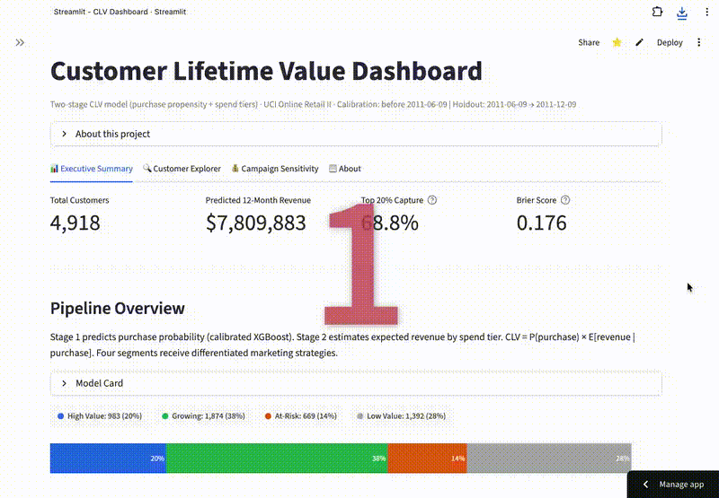
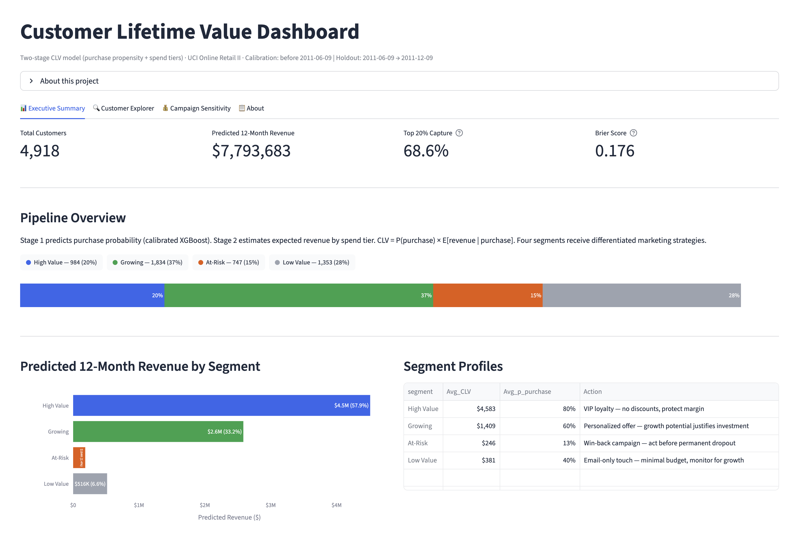
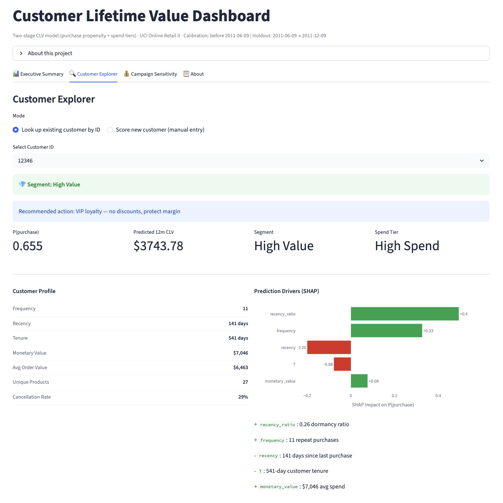
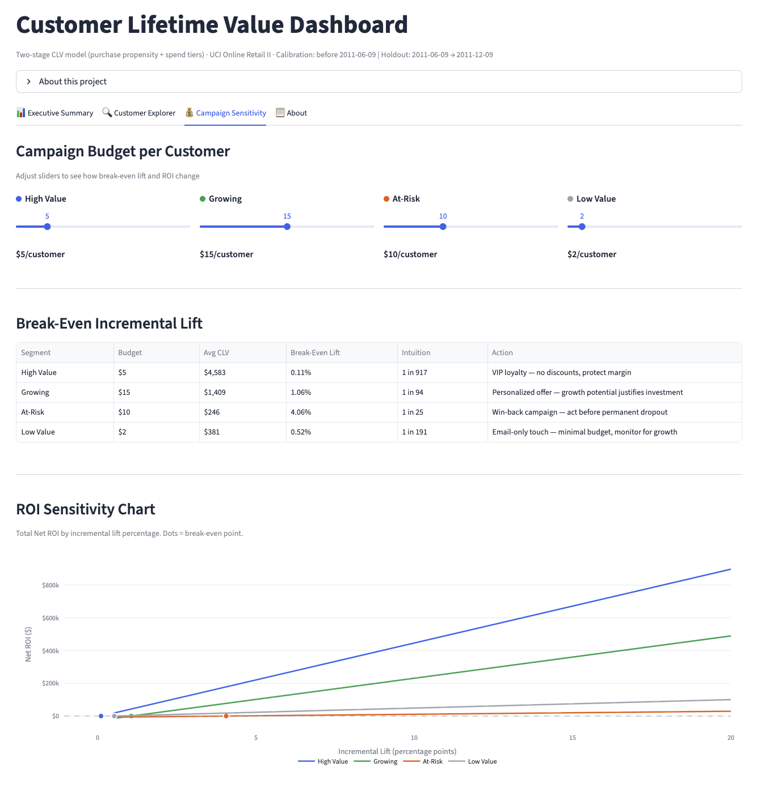
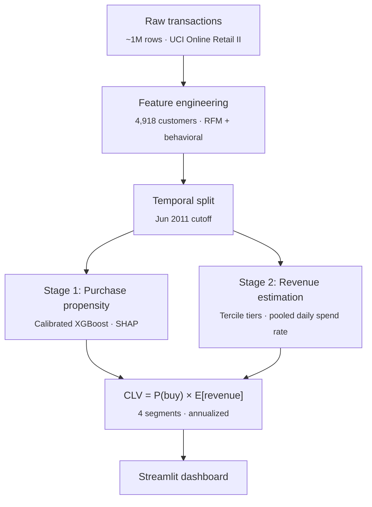

# Customer Lifetime Value Prediction


Which customers will buy again, and how much will they spend? This project scores 4,918 e-commerce customers into actionable marketing segments using a two-stage ML pipeline (purchase propensity + revenue estimation). In holdout validation on real transaction data, the top 20% of predicted CLV captured 69% of actual revenue.

## Live Demo

[**Try the interactive dashboard**](https://ecommerce-clv-prediction.streamlit.app/)

<!-- Replace with GIF after recording:  -->



|             Customer Explorer              |               Campaign Sensitivity               |
| :----------------------------------------: | :----------------------------------------------: |
|  |  |

## Key Results

| Metric              | Value                                 | What it means                                                              |
| ------------------- | ------------------------------------- | -------------------------------------------------------------------------- |
| Top 20% CLV capture | **68.8%** of actual holdout revenue   | The model correctly identifies the customers who matter most               |
| Brier score         | **0.1760** (29% better than baseline) | Probability estimates are 29% more accurate than assuming the base rate    |
| Revenue calibration | **0.897** ratio                       | Predictions are conservative by ~10%, operationally safe                   |
| Customers scored    | **4,918** across 4 segments           | Each segment has a differentiated campaign budget and break-even threshold |

## Pipeline



## Methodology

**Data preparation.** Starting from ~1M raw transactions (UCI Online Retail II, Dec 2009 to Dec 2011), the pipeline cleans and filters down to ~777K usable rows across 4,918 customers. A temporal split at June 2011 creates a calibration period for training and a 183-day holdout window for validation, preventing any data leakage.

**Stage 1: Purchase propensity.** A calibrated XGBoost classifier predicts each customer's probability of purchasing in the holdout window. Optuna tunes hyperparameters over 50 trials using PR-AUC, then isotonic calibration ensures the output probabilities are accurate (not just well-ranked). This matters because CLV is a dollar-weighted expectation: even small probability errors compound into large revenue misestimates.

**Stage 2: Expected revenue.** With only ~2,500 buyers in the calibration window, individual-level revenue regression would overfit. Instead, customers are grouped into three spend tiers (Low, Mid, High) via tercile splits on average transaction value. Expected revenue per tier is estimated using a pooled daily spend rate — sum(total spend) / sum(observation days) within each tier — which weights longer-observed customers more heavily, reducing noise from short-tenure spending bursts. Scaled to the 183-day holdout window, this produces tier estimates of $402, $851, and $2,866, with a 0.897 revenue calibration ratio against the holdout.

**CLV and segmentation.** The final CLV combines purchase probability with expected revenue (`P(purchase) x E[revenue]`), annualized from the 183-day window. Customers are then assigned to four priority-ordered segments (High Value, Growing, At-Risk, Low Value), each with a differentiated campaign budget and break-even lift threshold.

## Repo Structure

```
├── notebooks/
│   ├── 01_exploratory_data_analysis.ipynb         # Data cleaning, feature engineering
│   ├── 02_purchase_propensity_model.ipynb         # Model selection, tuning, SHAP
│   └── 03_customer_lifetime_value_segmentation.ipynb  # CLV, validation, segmentation
├── src/
│   └── app.py                                     # Streamlit dashboard
├── models/
│   ├── purchase_propensity_model.pkl              # Calibrated XGBoost
│   └── label_encoders.pkl                         # Country encoder
├── data/processed/
│   ├── clv_data.csv                               # Feature matrix (4,918 customers)
│   ├── stage1_scored.csv                          # With purchase probabilities
│   └── clv_final.csv                              # Final CLV + segments
├── assets/                                        # Dashboard screenshots
├── requirements.txt
└── .streamlit/config.toml                         # Theme config
```

## Setup

```bash
git clone https://github.com/dsyhub/customer-lifetime-value-prediction.git
cd customer-lifetime-value-prediction
pip install -r requirements.txt
streamlit run src/app.py
```

Processed data and trained models are committed to the repo, so the dashboard works immediately. To reproduce from scratch, download `online_retail_II.xlsx` from the [UCI ML Repository](https://archive.ics.uci.edu/dataset/502/online+retail+ii), place it in `data/raw/`, and run the three notebooks in order.

## Tech Stack

Python, XGBoost, scikit-learn, SHAP, Optuna, Streamlit, Plotly, pandas, NumPy, SciPy

## Next Steps

As the customer base grows, individual-level revenue regression can replace spend-tier averages for finer-grained CLV estimates. A/B testing the per-segment campaign budgets would measure true incremental lift and close the feedback loop between predictions and marketing outcomes.
